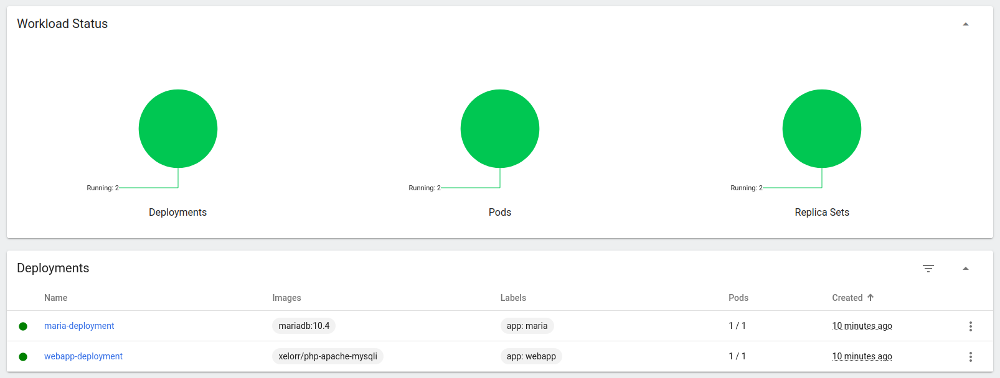

# My cluster setup

## Current issues and questions to deal with

- [ ] Apache - access forbidden... why?
- [ ] network, how should I specify database server in my php file?
- [x] database initialization -- is /data/application/init.sql initialized on start?
- [ ] database not initiated, ensure running `mysqld --init-file /data/application/init.sql` on setup, mydb not available
- [x] check if src folder mounted to webapp (mounted but empty)
- [x] check if init.sql mounted to maria (as folder... fixed)
- [ ] `/data/application` is empty... why?
- [ ] `/var/www/html` is empty... why?

## Files

1. [configmap](./configmap.yaml)
2. [secret](./secret.yaml)
3. [db](./db.yaml)
4. [web](./web.yaml)

## Commands to run

### Create container

```bash
# building and pushing to dockerhub
docker build -t xelorr/php-apache-mysqli -f ./dockerfiles/webapp.docker .
docker push xelorr/php-apache-mysql
```

```bash
# delete if exists
minikube delete -p petr-polyakov-kuber-sf

# create
minikube config set driver docker
minikube kubectl -- get po -A
minikube start --nodes 3 -p petr-polyakov-kuber-sf --driver=docker

# setting default and alias
minikube config set profile petr-polyakov-kuber-sf
alias kubectl="minikube kubectl --"

# adding objects from config
kubectl apply -f configmap.yaml,secret.yaml
cat web.yaml | sed "s|\.\/src|$(pwd)/src|" | kubectl apply -f -
cat db.yaml | sed "s|\.\/db-init|$(pwd)/db-init|" | kubectl apply -f -

# dashboard
minikube -p petr-polyakov-kuber-sf addons enable metrics-server
minikube dashboard -p petr-polyakov-kuber-sf &!

# exposing service
minikube service webapp-service

# invintory
kubectl get all -o wide
```

### Get into the pod to inspect

```bash
kubectl get pods
# NAME                                 READY   STATUS    RESTARTS   AGE
# maria-deployment-78dcb9ccdf-vr67d    1/1     Running   0          33m
# webapp-deployment-66b9bcf44b-swgr5   1/1     Running   0          33m
kubectl exec maria-deployment-78dcb9ccdf-vr67d -it -- /bin/bash
```

### Stop cluster

```bash
minikube stop -p petr-polyakov-kuber-sf
```

## Screenshots


