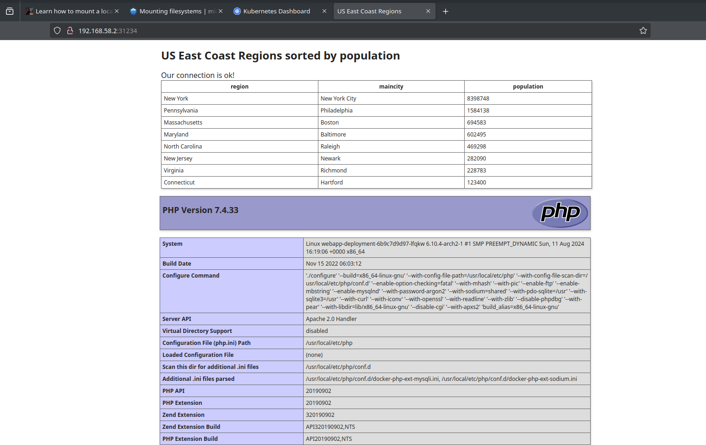

# My cluster setup

## Current issues and questions to deal with

- [x] Apache - access forbidden... why? (wrongly specifyed address, no configs)
- [x] network, how should I specify database server in my php file? (have to use services and configmap)
- [x] database initialization -- is /data/application/init.sql initialized on start?
- [x] check if src folder mounted to webapp (mounted but empty)
- [x] check if init.sql mounted to maria (as folder... fixed)
- [x] `/data/application` is empty... why? (known issue, unable to fix quickly)
- [x] `/var/www/html` is empty... why? (known issue, unable to fix quickly)
- [x] what if I copy required files? How can I download config automatickly? (php works if i expose server)
- [x] which object from my configs can be threated as ip? Which name should i ping to confirm one pode avaliability from another? (service name, but it is not pingable)
- [ ] read about kubernetes network fundamentals
- [x] database not initiated, ensure running `mysqld --init-file /data/application/init.sql` on setup, mydb not available or try workaround: https://stackoverflow.com/questions/45681780/how-to-initialize-mysql-container-when-created-on-kubernetes#45682775
- [x] repeat workaround for webapp, replacing hostmount with configmap, generated from php file

## Files

- [configmap](./configmap.yaml)
- [secret](./secret.yaml)
- [web](./web.yaml) - webapp deployment and service
- [db](./db.yaml) - database deployment and service
- [maria-init-configmap](./maria-init-configmap.yaml)
- [php-app-configmap](./php-app-configmap.yaml)

## Commands to run

### Create container

```bash
# building and pushing to dockerhub
docker build -t xelorr/php-apache-mysqli -f ./dockerfiles/webapp.docker .
docker push xelorr/php-apache-mysql
```

```bash
# creating configmaps from files
minikube kubectl -- create configmap maria-init --from-file=db-init/init.sql
minikube kubectl -- get configmaps maria-init -o yaml > maria-init-configmap.yaml

minikube kubectl -- create configmap php-app --from-file=src/index.php
minikube kubectl -- get configmaps php-app -o yaml > php-app-configmap.yaml
```

```bash
./rebuild-and-launch.sh

# dashboard
minikube -p petr-polyakov-kuber-sf addons enable metrics-server
minikube dashboard -p petr-polyakov-kuber-sf &!

# opening exposed service
minikube service webapp-service
```

```bash
# invintory
kubectl get all -o wide
```

### Get into the pod to inspect

```bash
./get-into-pod.sh maria-deployment
./get-into-pod.sh webapp-deployment
```

### Stop cluster

```bash
minikube stop -p petr-polyakov-kuber-sf
```

## Screenshots




## `kubectl get all -o wide` output:

```
NAME                                     READY   STATUS    RESTARTS        AGE   IP           NODE                         NOMINATED NODE   READINESS GATES
pod/maria-deployment-8574fd579c-8lrp8    1/1     Running   1 (4m58s ago)   17m   10.244.1.3   petr-polyakov-kuber-sf-m02   <none>           <none>
pod/webapp-deployment-5448c48d7c-prm6x   1/1     Running   1 (9m5s ago)    17m   10.244.1.2   petr-polyakov-kuber-sf-m02   <none>           <none>

NAME                     TYPE        CLUSTER-IP      EXTERNAL-IP   PORT(S)        AGE   SELECTOR
service/kubernetes       ClusterIP   10.96.0.1       <none>        443/TCP        17m   <none>
service/maria-service    ClusterIP   10.111.3.248    <none>        3306/TCP       17m   app=maria
service/webapp-service   NodePort    10.98.104.116   <none>        80:31234/TCP   17m   app=webapp

NAME                                READY   UP-TO-DATE   AVAILABLE   AGE   CONTAINERS   IMAGES                     SELECTOR
deployment.apps/maria-deployment    1/1     1            1           17m   mariadb      mariadb:10.4               app=maria
deployment.apps/webapp-deployment   1/1     1            1           17m   webapp       xelorr/php-apache-mysqli   app=webapp

NAME                                           DESIRED   CURRENT   READY   AGE   CONTAINERS   IMAGES                     SELECTOR
replicaset.apps/maria-deployment-8574fd579c    1         1         1       17m   mariadb      mariadb:10.4               app=maria,pod-template-hash=8574fd579c
replicaset.apps/webapp-deployment-5448c48d7c   1         1         1       17m   webapp       xelorr/php-apache-mysqli   app=webapp,pod-template-hash=5448c48d7c
```

## Inventory table

|                    | webapp-deployment | maria-deployment |
| ------------------ | ----------------- | ---------------- |
| software installed |                   |                  |
| node count         |                   |                  |
| operating system   |                   |                  |
| ip address         |                   |                  |
| comment            |                   |                  |
