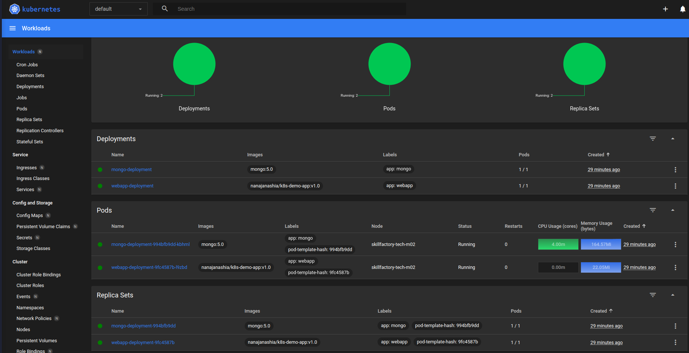

# Пример приложения, предоставленный на курсе

1. [configmap](1_configmap.yaml)
2. [secret](2_mongo-secret.yaml)
3. [database](3_database.yaml)
4. [webapp](4_webapp.yaml)

## Как запустить сие

(заработало)

```bash
# delete if exists
minikube delete -p skillfactory-tech

# create
minikube config set driver virtualbox
minikube kubectl -- get po -A
minikube start --nodes 3 -p skillfactory-tech --driver=virtualbox

# deploynment
minikube config set profile skillfactory-tech
alias kubectl="minikube kubectl --"
kubectl apply -f 1_configmap.yaml,2_mongo-secret.yaml,3_database.yaml,4_webapp.yaml

# addons for dashboard
minikube -p skillfactory-tech addons enable metrics-server

# dashboard
minikube dashboard -p skillfactory-tech &!

# exposing service
kubectl expose deployment/skillfactory-tech-m02 --type="NodePort" --port 8080 --cluster skillfactory-tech
```


